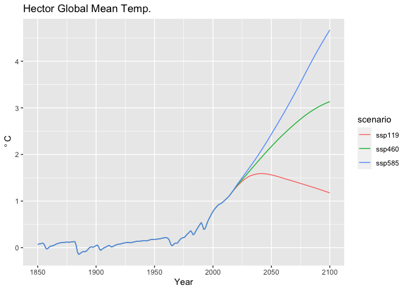

<!-- README.md is generated from README.Rmd. Please edit that file -->

# hectordata

The purpose of `hectordata` is to provide a reproducible method for
generating emissions csv tables and ini files for
[Hector](https://github.com/jgcri/hector), the simple climate model.
Users access pre-built inputs from `hectordata` or can use functions to
generate the inputs files on their own.


[](https://codecov.io/gh/JGCRI/hectordata)

## Installation

Use `install_github` from the `remotes` pacakge to install `hectordata`.

``` r
library(remotes)
install_github("JGCRI/hectordata")
```

## Using the pre-built inputs

This example assumes that `hectordata`,
[`hector`](https://github.com/jgcri/hector), and `ggplot2` have already
been installed.

``` r
library(hector)
library(hectordata)
library(ggplot2)
```

Take a look at the pre-built ini files included in `hectordata` using
the `system.file` call.

``` r
hectordata_dir <- system.file("input",  package = "hectordata")
list.files(hectordata_dir, pattern = ".ini")
```

    ## [1] "hector_ssp119.ini"      "hector_ssp126.ini"      "hector_ssp245.ini"     
    ## [4] "hector_ssp370.ini"      "hector_ssp434.ini"      "hector_ssp460.ini"     
    ## [7] "hector_ssp534-over.ini" "hector_ssp585.ini"

Let’s run hector for the ssp119, ssp460, and ssp585 scenarios. Start by
defining the path to the ini files.

``` r
ini_ssp119 <- system.file("input/hector_ssp119.ini", package = "hectordata")
ini_ssp460 <- system.file("input/hector_ssp460.ini", package = "hectordata")
ini_ssp585 <- system.file("input/hector_ssp585.ini", package = "hectordata")
```

Set up the hector cores.

``` r
core_ssp119 <- newcore(ini_ssp119, name = "ssp119")
core_ssp460 <- newcore(ini_ssp460, name = "ssp460")
core_ssp585 <- newcore(ini_ssp585, name = "ssp585")
```

Run hector.

``` r
run(core_ssp119)
```

    ## Hector core: ssp119
    ## Start date:  1745
    ## End date:    2300
    ## Current date:    2300
    ## Input file:  /Users/dorh012/Library/R/3.6/library/hectordata/input/hector_ssp119.ini

``` r
run(core_ssp460)
```

    ## Hector core: ssp460
    ## Start date:  1745
    ## End date:    2300
    ## Current date:    2300
    ## Input file:  /Users/dorh012/Library/R/3.6/library/hectordata/input/hector_ssp460.ini

``` r
run(core_ssp585)
```

    ## Hector core: ssp585
    ## Start date:  1745
    ## End date:    2300
    ## Current date:    2300
    ## Input file:  /Users/dorh012/Library/R/3.6/library/hectordata/input/hector_ssp585.ini

Get the results for global mean temp for each run.

``` r
dates <- 1850:2100
var <- GLOBAL_TEMP()

dat1 <- fetchvars(core_ssp119, dates, var)
dat2 <- fetchvars(core_ssp460, dates, var)
dat3 <- fetchvars(core_ssp585, dates, var)

data <- rbind(dat1, dat2, dat3)
```

Plot the results.

``` r
ggplot(data) + 
  geom_line(aes(year, value, color = scenario)) + 
  labs(title = "Hector Global Mean Temp.", 
       y = expression(~degree~"C"), 
       x = "Year")
```

<!-- -->

Shutdown Hector cores

``` r
shutdown(core_ssp119)
shutdown(core_ssp460)
shutdown(core_ssp585)
```
